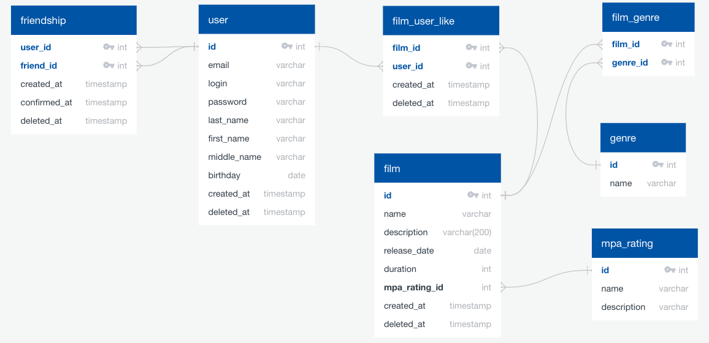

# Дизайн базы данных для проекта Java-Filmorate


Дизайн выполнен на платформе:
https://app.quickdatabasediagrams.com/#/

Код дизайна - в файле:
[quickdatabasediagrams.txt](quickdatabasediagrams.txt)


# Некоторые пояснения по структуре БД в разрезе бизнес-логики приложения:
1. Никакие данные из БД не удаляются, вместо этого для некоторых основных сущностей введено поле ```deleted_at``` с датой удаления. Считаем, что актуальная запись имеет ```deleted_at ISNULL```.
2. Для возможного будущего анализа для некоторых основных сущностей введено поле ```created_at``` с датой создания. Можно будет отобрать создание пользователей, фильмов или возникновение дружбы за опеределенный период.
3. Жанры и рейтинг MPA добавляются отдельным эндпоинтом. (Если будет нужно, то сделать и удаление через ```deleted_at```).
4. Добавить фильм можно будет только с существующим жанром и рейтингом MPA, иначе будет исключение.
5. Этапы возникновения дружбы: 
   - нет дружбы: в таблице **friendship** не записи с ключами ```user_id + friend_id```
   - запрос на дружбу: в таблице **friendship** есть запись с ключами ```user_id + friend_id``` при этом поле ```confirmed_at ISNULL```. Для каждого пользователя создается своя запись, то есть фактически записей будет две, где юзеры меняются местами.
   - есть дружба: в таблице **friendship** есть запись с ключами ```user_id + friend_id``` при этом в поле ```confirmed_at``` стоит дата возникновения дружбы, а поле ```deleted_at ISNULL```.
   - дружба удалена: в таблице **friendship** есть запись с ключами ```user_id + friend_id``` при этом в поле ```deleted_at``` стоит дата удаления дружбы. 


# Основные запросы для обработки бизнес-логики:
1. Получить все фильмы:
```sql
SELECT * 
FROM film
WHERE deleted_at ISNULL
```

2. Получить фильм по id:
```sql
SELECT * 
FROM film 
WHERE id = {id}
AND deleted_at ISNULL
```

3. Получить информацию о жанрах фильма:
```sql
SELECT g.name 
FROM genre g
INNER JOIN film_genre fg ON fg.genre_id = g.id
WHERE film_id = {film_id}
AND deleted_at ISNULL
```

4. Получить информацию о фильме вместе с рейтингом MPA:
```sql
SELECT f.*, r.name AS mpa_rating_name
FROM film f
INNER JOIN mpa_rating r ON f.mpa_rating_id = r.id
WHERE f.id = {film_id}
AND deleted_at ISNULL
```

5. Получить 10 самых популярных фильмов:
```sql
SELECT f.*, COALESCE(l.likes, 0) likes
FROM film f
LEFT JOIN (
	SELECT film_id, COUNT(*) likes
	FROM film_user_like
        WHERE deleted_at ISNULL
	GROUP BY film_id
) AS l
ON f.id = l.film_id
WHERE f.deleted_at ISNULL
ORDER BY likes DESC
LIMIT 10
```

6. Алгоритм добавления фильма:  
    - Выбрать из таблицы **mpa_rating** значение **mpa_rating.id** по названию (например: G, M, PG-13, NC-17 итд.)
    - Если имя рейтинга не найдено - выбросить исключение, что такой рейтинг MPA не найден (дополнительно сделать отдельный эндпоинт по добавлению MPA рейтингов)
    - Добавить в таблицу **film** данные о фильме, включая **mpa_rating_id**, получить **film_id**
    - Для каждого жанра фильма выбрать из таблицы **genre** значение **genre.id**
    - Если жанр не найден - выбросить исключение, что такой жанр не найден (дополнительно сделать отдельный эндпоинт по добавлению жанров)
    - Каждый **genre_id** записать в таблицу **film_genre** вместе с **film_id** 

7. Алгоритм добавления лайка:
    - Проверить, что существуют пользователь и фильм с указанными id
    - Если нет - исключение
    - Проверить, что не существует активного (```deleted_at ISNULL```) лайка этого пользователя этому фильму
    - Если существует - исключение, что лайк уже есть
    - Если существует неактивный (```deleted_at NOTNULL```), то обновить запись: ```created_at = NOW(), deleted_at = NULL```
    - Если не существует - добавить запись в таблицу **film_user_like**
    
8. Алгоритм удаления лайка:
    - Проверить, что существуют пользователь и фильм с указанными id
    - Если нет - исключение
    - Найти активный лайк (```deleted_at ISNULL```) этого пользователя этому фильму
    - Если нет активного лайка - исключение
    - Если есть неактивный лайк - исключение, что лайк уже был удален
    - Если есть активный - обновить запись: ```deleted_at = NOW()```
    
9. Получить всех пользователей
```sql
SELECT * 
FROM user
WHERE deleted_at ISNULL
```

10. Получить пользователя по id
```sql
SELECT * 
FROM user
WHERE id = {id}
AND deleted_at ISNULL
```

11. Получить всех подтвержденных друзей пользователя 
```sql
SELECT * 
FROM friendship
WHERE user_id = {user_id}
AND confirmed_at NOTNULL
AND deleted_at ISNULL
```

12. Получить все запросы на дружбу (неподтвержденных друзей)
```sql
SELECT * 
FROM friendship
WHERE user_id = {user_id}
AND confirmed_at ISNULL
AND deleted_at ISNULL
```

13. Получить общих друзей двух пользователей
```sql
SELECT friend_id 
FROM friendship f1 
WHERE f1.user_id = {user_id1}
AND confirmed_at NOTNULL
AND deleted_at ISNULL
INTERSECT 
SELECT friend_id 
FROM friendship f2
WHERE f2.user_id = {user_id2}
AND confirmed_at NOTNULL
AND deleted_at ISNULL
```

14. Получить все лайки пользователя
```sql
SELECT * 
FROM film_user_like
WHERE user_id = {user_id}
AND deleted_at ISNULL
```

15. Создать запрос на дружбу
   - Проверить по id, что пользователи существуют
   - Проверить, что в таблице friendship не существует активной записи дружбы (```deleted_at NOTNULL```)
   - Если существует - исключение
   - Если существует неактивная запись (```deleted_at ISNULL```) - обновить ее: ```created_at = NOW(), deleted_at = NULL```
   - Если никакой не существует - создать, где ```confirmed_at = NULL```

16. Подтвердить дружбу
   - Проверить, что пользователи существуют
   - Найти запись дружбы, где ```deleted_at ISNULL``` и ```confirmed_at ISNULL```
   - Если не найдено - исключение
   - Обновить запись: ```confirmed_at = NOW()```

17. Отменить дружбу
   - Проверить по id, что пользователи существуют
   - Проверить, что в таблице friendship существует активная записи дружбы (```deleted_at NOTNULL```)
   - Если не существует - исключение
   - Если существует неактивная запись - исключение, что уже нет этой дружбы
   - Если существует активная - обновить:  ```deleted_at = NULL```
   
18. Удалить пользователя
   - Проверить по id, что пользователь существует
   - Если он не активный (```deleted_at ISNULL```), то исключение, что пользователь уже был удален
   - Если активный - обновить запись: ```deleted_at = NOW()```

### Ревью:

Очень качественно выполненная работа, не выявил ни одного недочёта. Сделано гораздо больше требований ТЗ. Почерпнул много нового для себя)
